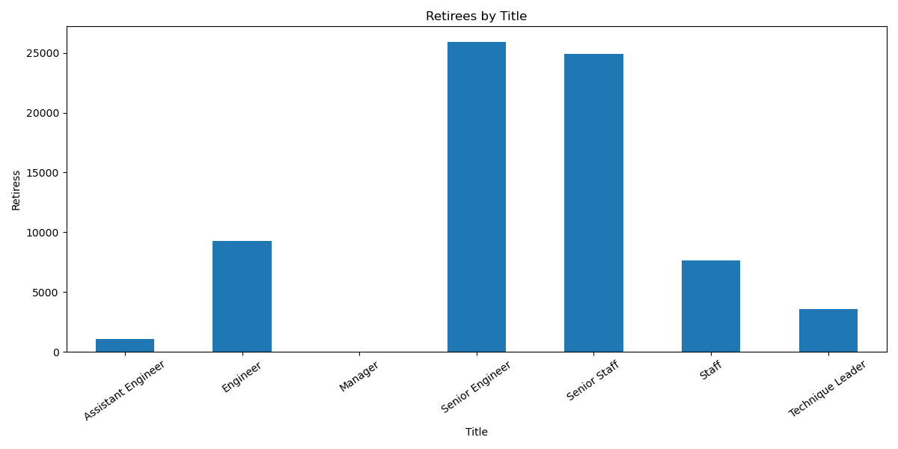

# Pewlett_Hackard_Analysis

## Overview
From preliminary analysis Pewlett Packard is anticipating that a "silver tsunami" is coming and that many employees for the company will soon be retiring. The first objective of the analysis is to determine the number of employees that will be retiring by job title. The second component is to determine which employees are eligible to participate in the employee mentorship program to invest in their professional growth and development and support employee retention for the company to prepare for the large number of retirees.

## Results
* The two job titles that are going to have the most retirees are from the Senior Engineer and Senior Staff positions with both titles having approximately 25,000 retirees. 

* The top two departments that have the most amount of Senior Engineers retiring are from Development and Production departments of 6834 and 5924, respectively.
* The two titles that have the most mentorship eligibility are Senior Engineer and Staff with about 500 eligible employees each. 
* On average the amount of mentorship eligible employees by job title compared to the number of retirees per job title is approximately 2% with the exception of Staff at 7.5% and Senior Staff at less than 1%. Comparing these number to industry standards would be another analysis that PW could perform.
There is a bulleted list with four major points from the two analysis deliverables. 
## Summary
From analyzing the charts, it looks as though the Senior Engineer, Engineer and Technique Leader positions are about equal in the ratio of retirees to mentorship eligible employees. Staff employees have the most eligible employees which could provide opportunity for PW to invest and train the current Staff members to be promoted to Senior staff, incentivizing the current Staff employees with the possibility of promotion.

Another query and table that were created break down the retiring employees by department which allows PW to focus on which departments need the most assistance in filling future vacant positions. Below are the query and the results of table created. 

In summary it seems that Pewlett Hackard is going to have significantly more employees retiring than are eligible for mentorships or promotions to fill the vacant positions. An analysis on how many positions per department is in order to be able to develop a plan for employee recruitment or further training.

